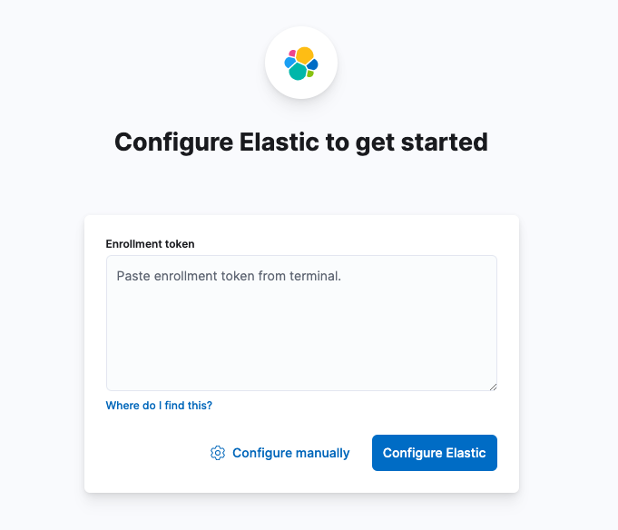
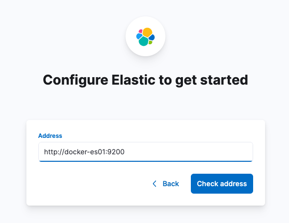
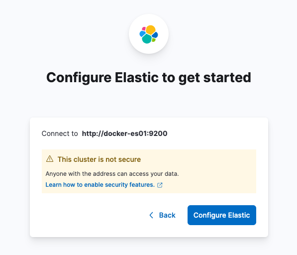

elasticsearch-get-started
===


## Start Elasticsearch and Kibana

1. Create Network

    ```bash
    docker network create esnet --subnet=172.30.0.0/16 --gateway=172.30.0.254
    ```
1. Build

    ```bash
    docker compose build
    ```

1. Up

    ```bash
    docker compose up -d
    ```

## Setup Kibana

1. Access `http://0.0.0.0:5601`

    

1. Configure manually

    Input `http://docker-es01:9200` to **Address**.
    
    
    
1. Finish

    
    
## Call API using cURL

### Cluster

#### Health

```bash
curl -X GET 'http://localhost:9200/_cluster/health?pretty'
```

### Index

#### Create

```bash
curl -X PUT 'http://localhost:9200/customer/'
```

#### Describe

```bash
curl -X GET 'http://localhost:9200/customer?pretty'
```

```bash
curl -X GET 'http://localhost:9200/_cat/indices?v'
```

### Document

#### Create

```bash
curl -X POST 'http://localhost:9200/customer/_doc?pretty' \
-H 'COntent-Type: application/json' \
-d '{"name": "鈴木 一郎", "comment": "こんにちは。私の名前は鈴木一郎です。普段はアメリカで仕事をしています。"}'

curl -X POST 'http://localhost:9200/customer/_doc?pretty' \
-H 'COntent-Type: application/json' \
-d '{"name": "山田 太郎", "comment": "こんにちは。私の名前は山田太郎です。普段は東京で仕事をしています。"}'

curl -X POST 'http://localhost:9200/customer/_doc?pretty' \
-H 'COntent-Type: application/json' \
-d '{"name": "田中 太一", "comment": "こんにちは。私の名前は太一です。普段は東京で遊んでいます。"}'
```

#### Search

```bash
curl -X GET 'http://localhost:9200/customer/_search/?pretty' \
-H 'Content-Type: application/json' \
-d '{"query": {"match": {"comment": "東京"}}}'
```